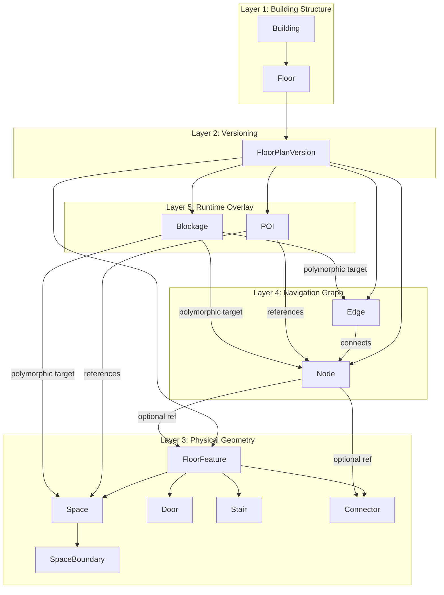

# ĐÁNH GIÁ CHI TIẾT HỆ THỐNG ĐỒ THỊ (NODES/EDGES), THUẬT TOÁN DẪN ĐƯỜNG VÀ CƠ CHẾ RÀO CẢN (BLOCKAGES)

Tài liệu này cung cấp cái nhìn chi tiết và đánh giá kỹ thuật sâu sắc về cách thức hoạt động của hệ thống điều hướng trong nhà (Indoor Navigation) của dự án **InMap Hospital**. Nội dung tập trung vào cấu trúc đồ thị (Nodes/Edges), các thuật toán tìm đường (A*), cơ chế sinh chỉ dẫn rẽ hướng và hệ thống quản lý rào cản động (Blockages) trong thời gian chạy.

---

## 1. Cơ Chế Khởi Tạo & Ánh Xạ Đỉnh (Nodes) và Cạnh (Edges)

Hệ thống biểu diễn mạng lưới đường đi trong bệnh viện dưới dạng một đồ thị có trọng số đa tầng (Multi-floor Weighted Graph). Trong mã nguồn hiện tại, có hai mô hình thiết kế cơ sở dữ liệu được phát triển:

### 1.1. So Sánh Hai Mô Hình Cơ Sở Dữ Liệu

#### Mô hình Đồ thị truyền thống (v2/v3 - được cấu hình trong `init.sql` và `init_v3_schema.sql`)
Mô hình này tối giản và tập trung trực tiếp vào các nút dẫn đường:
* **`map_nodes` (hoặc `spaces`)**: Lưu trữ các điểm vật lý (phòng bệnh, sảnh, hành lang, thang máy, thang bộ) với tọa độ mặt phẳng 2D `(x, y)`. Mỗi đỉnh có thuộc tính vẽ trực tiếp (`render_width`, `render_depth`, `wall_height`, `wall_color`, `floor_color`) giúp dựng mô hình 3D/2D trực tiếp.
* **`edges`**: Lưu trữ các cạnh nối giữa các nút vật lý với trọng số khoảng cách (`weight`), thể loại di chuyển (`walk`, `elevator`, `stairs`), và tính chất hướng di chuyển (`bidirectional`).
* **`room_vertices`**: Lưu trữ chuỗi các đỉnh 2D của đa giác phòng nhằm vẽ các không gian phi hình chữ nhật (như hình chữ L, hình bát giác).

#### Mô hình Đa giác 5 lớp nâng cao (`schema_polygon.sql`)
Đây là thiết kế mở rộng phân chia hệ thống thành 5 lớp chuyên biệt:
1. **Lớp 1: Cấu trúc tòa nhà** (`building`, `floor`): Lưu thông tin cấu trúc vật lý cơ bản.
2. **Lớp 2: Phiên bản bản đồ** (`floor_plan_version`): Quản lý các bản thảo sơ đồ (draft, published, archived), cho phép chỉnh sửa bản đồ mà không ảnh hưởng trực tiếp đến người dùng đang chạy ứng dụng.
3. **Lớp 3: Thực thể mặt sàn** (`floor_feature`, `space`, `space_boundary`, `door`, `stair`, `connector`): Định nghĩa hình học GeoJSON của không gian sàn. Lớp này tách biệt hoàn toàn giữa cấu trúc tường, cửa vật lý với đồ thị dẫn đường.
4. **Lớp 4: Đồ thị dẫn đường** (`node`, `edge`): Đồ thị dẫn đường thuần túy được tách riêng. Một `node` có thể tham chiếu tới một `feature_id` (cửa hoặc phòng) hoặc `connector_id` (thang máy). Cạnh `edge` lưu chi phí di chuyển thực tế.
5. **Lớp 5: Thời gian chạy (Runtime)** (`poi`, `blockage`): Chứa các điểm quan tâm động (POIs) và các điểm rào cản/bảo trì tạm thời (`blockage`).



### 1.2. Ánh xạ Đồ thị Trong Bộ Nhớ (In-Memory Graph Mapping)

Khi ứng dụng chạy, API tải dữ liệu thô từ cơ sở dữ liệu quan hệ (`/api/map-data`) và chuyển đổi thành đồ thị kề trong bộ nhớ tại `src/lib/mapDataLoader.ts` (`layoutToGraphNodes`):

1. **Xây dựng danh sách kề nhanh (Adjacency List)**: 
   Để tránh việc lặp qua danh sách cạnh $O(|E|)$ ở mỗi bước duyệt của thuật toán tìm đường, hệ thống chuyển đổi các cạnh thành danh sách kết nối gắn trực tiếp vào từng đỉnh:
   ```typescript
   const connMap = new Map<string, string[]>();
   for (const edge of layout.edges) {
     const from = edge.fromNodeId ?? edge.from_node_id;
     const to = edge.toNodeId ?? edge.to_node_id;
     if (!connMap.has(from)) connMap.set(from, []);
     connMap.get(from)!.push(to);

     if (edge.bidirectional) {
       if (!connMap.has(to)) connMap.set(to, []);
       connMap.get(to)!.push(from);
     }
   }
   ```
2. **Tính toán tọa độ cao độ 3D động (`z`)**: 
   Được lấy trực tiếp từ trường `height_offset` của tầng bản đồ. Nếu thuộc tính này bị trống, hệ thống tự động gán độ cao tương đối bằng công thức:
   $$z = \text{floorNumber} \times 6$$
   (Với giả định khoảng cách trung bình giữa các tầng là 6 mét).
3. **Đóng gói metadata phòng**: Gộp các cấu hình render hiển thị từ cơ sở dữ liệu vào trường `metadata` của `GraphNode` để cung cấp đầy đủ thông tin cho Canvas 3D render.

---

## 2. Thuật Toán Tìm Đường (Pathfinding Algorithms)

Dự án cài đặt hai biến thể thuật toán tìm đường A*: **A* Cơ bản** (`aStar.ts`) và **A* Tối ưu hóa** (`aStarOptimized.ts`).

### 2.1. Hàm Heuristic Ước Lượng 3D

A* sử dụng hàm ước lượng khoảng cách $h(n)$ để định hướng tìm kiếm về phía đích. Ở đây, khoảng cách Euclid 3D được sử dụng kết hợp với hình phạt chuyển tầng:

```typescript
function heuristic(a: GraphNode, b: GraphNode): number {
  const dx = a.x - b.x;
  const dy = a.y - b.y;
  const floorDiff = Math.abs(a.floor - b.floor);
  // Khoảng cách hình học 2D cộng thêm chi phí di chuyển tầng dọc (5m phạt/tầng)
  return Math.sqrt(dx * dx + dy * dy) + floorDiff * 5;
}
```

> [!NOTE]
> Hình phạt cộng thêm `floorDiff * 5` mét ảo giúp giảm thiểu việc thuật toán chọn các lộ trình chuyển tầng liên tục (lên xuống thang máy quá nhiều lần) khi khoảng cách di chuyển mặt đất có sự chênh lệch nhỏ.

### 2.2. A* Cơ Bản (`aStar.ts`) vs A* Tối Ưu Nâng Cao (`aStarOptimized.ts`)

| Đặc tính kỹ thuật | A* Cơ Bản (`aStar.ts`) | A* Tối Ưu Nâng Cao (`aStarOptimized.ts`) |
| :--- | :--- | :--- |
| **Cấu trúc Open Set** | `Set<string>` (tập hợp phẳng) | **Min-Heap (Binary Heap)** tự thiết kế (`MinHeap.ts`) |
| **Độ phức tạp lấy nút nhỏ nhất** | $O(N)$ (lặp tuyến tính qua toàn bộ Set) | **$O(\log N)$** (thao tác pop/sinkDown trên Heap) |
| **Hiệu năng tổng quát** | $O(N^2)$ (chậm khi đồ thị lớn) | **$O(N \log N)$** (phản hồi cực nhanh dưới 1ms) |
| **Tùy chọn di chuyển** | Không có (chỉ tìm đường ngắn nhất) | Hỗ trợ 3 tùy chọn: `shortest`, `accessible`, `avoid_stairs` |
| **Xử lý rào cản động** | Không hỗ trợ | Áp dụng lớp đè rào cản động (Dynamic Blockages Overlay) |
| **Lọc nhiễu rẽ hướng** | Ngưỡng rẽ nhạy cảm thấp (`0.1`) | Ngưỡng rẽ chống nhiễu cao (`1.0`) |
| **Cơ chế Cache** | Không có | Tích hợp lớp đệm **Path Cache 5-phút TTL** |

### 2.3. Tùy Biến Lộ Trình Theo Nhu Cầu Người Dùng (`PathOptions`)

Trong bản tối ưu hóa, chi phí di chuyển thực tế giữa 2 đỉnh kề nhau được tính toán thông qua hàm `edgeCost`:

* **Xe lăn/Hạn chế vận động (`accessible`)**:
  Nếu nút tiếp theo có loại là cầu thang bộ (`stairs`), chi phí cạnh được gán bằng **`Infinity`** (Chặn hoàn toàn). Thuật toán bắt buộc phải chọn thang máy hoặc lối đi phẳng.
* **Tránh cầu thang bộ (`avoid_stairs`)**:
  Nếu nút tiếp theo là cầu thang bộ, khoảng cách hình học sẽ bị nhân với hệ số **phạt gấp 5 lần**. Thuật toán vẫn có thể đi thang bộ nếu là lối đi duy nhất, nhưng sẽ ưu tiên thang máy nếu có đường khác.
* **Đường đi ngắn nhất (`shortest`)**:
  Tính theo khoảng cách hình học Euclid thực tế giữa 2 điểm.

```typescript
if (opts.preference === 'accessible' && b.type === 'stairs') {
  return Infinity;
}
if (opts.preference === 'avoid_stairs' && b.type === 'stairs') {
  baseCost = baseCost * 5;
}
```

### 2.4. Nhận Diện Rẽ Hướng Bằng Tích Vô Hướng Chéo (Vector Cross Product)

Để sinh ra tập hợp hướng dẫn chỉ đường từng bước dạng văn bản (Turn-by-turn Instructions) thân thiện với người dùng, thuật toán so sánh hướng của 2 phân đoạn liên tiếp tạo bởi 3 nút liên tiếp trong lộ trình: $A (i-2) \to B (i-1) \to C (i)$.

Hai vector hướng di chuyển được định nghĩa:
$$\vec{v_1} = B - A = (x_B - x_A, y_B - y_A)$$
$$\vec{v_2} = C - B = (x_C - x_B, y_C - y_B)$$

Tích vô hướng chéo trong không gian 2D:
$$\text{cross} = v_{1x} \cdot v_{2y} - v_{1y} \cdot v_{2x}$$

```typescript
const TURN_THRESHOLD = 1.0;

function detectTurn(prevPrev: GraphNode, prev: GraphNode, curr: GraphNode): 'left' | 'right' | 'straight' {
  if (prevPrev.floor !== curr.floor) return 'straight';
  const v1 = { x: prev.x - prevPrev.x, y: prev.y - prevPrev.y };
  const v2 = { x: curr.x - prev.x,     y: curr.y - prev.y     };
  const cross = v1.x * v2.y - v1.y * v2.x;
  
  if (cross > TURN_THRESHOLD) return 'left';
  if (cross < -TURN_THRESHOLD) return 'right';
  return 'straight';
}
```

* Nếu $\text{cross} > 1.0$: Lộ trình rẽ về bên **trái** của hướng đi hiện tại. Sinh câu lệnh: `"Rẽ trái vào [Tên nút]"`.
* Nếu $\text{cross} < -1.0$: Lộ trình rẽ về bên **phải** của hướng đi hiện tại. Sinh câu lệnh: `"Rẽ phải vào [Tên nút]"`.
* Nằm trong khoảng $[-1.0, 1.0]$: Hướng đi thẳng. Thuật toán sẽ cộng dồn khoảng cách di chuyển và phát chỉ dẫn đi thẳng tích lũy (ví dụ: `"Đi thẳng khoảng 25m"`).

### 2.5. Cơ Chế Bộ Nhớ Đệm Đường Đi (Path Caching Layer)

Tại `src/algorithms/pathCache.ts`, một cơ chế lưu cache được thiết lập để tránh tính toán lại A* nhiều lần khi người dùng chuyển đổi qua lại giữa các màn hình hoặc các tầng:
* **Khóa Cache (Cache Key)**: Định dạng `${startId}:${endId}:${opts.preference}` để tách biệt các lộ trình khác nhau từ cùng một điểm xuất/phát.
* **Thời gian sống (TTL)**: Mặc định là **5 phút** (`5 * 60 * 1000` ms). Sau thời gian này, cache hết hạn và đồ thị sẽ được tính toán lại từ đầu.
* **Vô hiệu hóa (Invalidation)**: Hệ thống cung cấp hàm `invalidatePathCache()` để xóa sạch toàn bộ cache khi bản đồ được cập nhật trên Admin panel, và `invalidateRoute(start, end)` để xóa riêng một lộ trình cụ thể khi phát hiện sự cố tắc nghẽn tức thời.

---

## 3. Cơ Chế Rào Cản & Sự Cố Bản Đồ (Blockages Overlay System)

Hệ thống quản lý rào cản động (**Blockages**) cho phép quản trị viên chặn hoặc hạn chế tạm thời một số khu vực hoặc nút giao thông trong bệnh viện (ví dụ: thang máy bảo trì, khu vực đang lau dọn, hành lang đang thi công).

### 3.1. Thiết Kế Cơ Sở Dữ Liệu Bảng `blockages`

Bảng `blockages` lưu trữ các thông tin rào cản động:
* `blockage_type`: Phân loại đối tượng rào cản, gồm: `'node'`, `'edge'`, `'space'`, `'door'`, `'stair'`, `'area'`.
* `target_id`: ID của đối tượng đích bị chặn (ví dụ: ID của nút, ID của cạnh).
* `status`: Trạng thái rào cản:
  * `'active'`: Rào cản có hiệu lực ngay lập tức.
  * `'inactive'`: Rào cản không hoạt động.
  * `'scheduled'`: Rào cản tự động kích hoạt dựa trên khung thời gian.
* `severity`: Mức độ nghiêm trọng của rào cản: `'warning'` (cảnh báo), `'restricted'` (hạn chế), `'blocked'` (chặn hoàn toàn).
* `start_at` / `end_at`: Khung giờ lập lịch kích hoạt (đối với trạng thái `'scheduled'`).
* `geometry`: Trường JSON lưu tọa độ đa giác phẳng (đối với loại rào cản vùng `'area'`).

### 3.2. Lọc Rào Cản Đang Hoạt Động (Active Blockages)

Hệ thống lọc các rào cản có hiệu lực thông qua câu lệnh SQL tại `MySQLBlockageRepository.findActive()`:

```sql
SELECT * FROM blockages 
WHERE status = 'active'
   OR (status = 'scheduled' AND (start_at IS NULL OR start_at <= NOW()) AND (end_at IS NULL OR end_at >= NOW()))
```

### 3.3. Các Loại Rào Cản & Cách Thức Ánh Xạ

Trong quá trình chạy thuật toán A* tại `aStarOptimized.ts`, hàm duyệt chi phí cạnh `edgeCost` sẽ liên tục đối chiếu cạnh $(a, b)$ đang xét với danh sách rào cản đang hoạt động:

1. **Rào cản Đơn điểm (`node` / `space` / `door` / `stair`)**:
   Áp dụng nếu ID của nút hiện tại $a$ hoặc nút kế tiếp $b$ trùng với `targetId` của rào cản.
2. **Rào cản Cạnh nối (`edge`)**:
   Áp dụng nếu cạnh nối giữa $a$ và $b$ trùng với rào cản. Hệ thống kiểm tra cả 4 trường hợp định danh cạnh nối để đảm bảo tính chính xác:
   ```typescript
   function isEdgeBlocked(blockageTargetId: string, fromId: string, toId: string): boolean {
     const expectedId1 = `e-${fromId}-${toId}`;
     const expectedId2 = `e-${toId}-${fromId}`;
     return blockageTargetId === expectedId1 || 
            blockageTargetId === expectedId2 || 
            blockageTargetId === `${fromId}-${toId}` || 
            blockageTargetId === `${toId}-${fromId}`;
   }
   ```
3. **Rào cản Vùng (`area`)**:
   Đây là tính năng nâng cao. Khi một khu vực (ví dụ: khu vực thi công hành lang) bị khoanh vùng bằng một đa giác tọa độ (`polygon: [number, number][]`), thuật toán sẽ kiểm tra xem tọa độ nút kế tiếp $b(x, y)$ có rơi vào vùng đa giác này hay không thông qua **Thuật toán Phóng tia (Ray-Casting Algorithm)**:

```typescript
function isPointInPolygon(x: number, y: number, polygon: [number, number][]): boolean {
  let inside = false;
  for (let i = 0, j = polygon.length - 1; i < polygon.length; j = i++) {
    const xi = polygon[i][0], yi = polygon[i][1];
    const xj = polygon[j][0], yj = polygon[j][1];
    
    // Kiểm tra giao điểm của tia nằm ngang từ (x, y) với cạnh đa giác (xi, yi) - (xj, yj)
    const intersect = ((yi > y) !== (yj > y))
        && (x < (xj - xi) * (y - yi) / (yj - yi) + xi);
    if (intersect) inside = !inside;
  }
  return inside;
}
```

```
           Tia phóng ngang từ điểm đang xét
(x, y) ───────────────> [Cắt cạnh đa giác lần 1] ───────────────> [Cắt cạnh lần 2]
   │
   └─ Nếu tổng số lần cắt là SỐ LẺ -> Điểm nằm TRONG đa giác rào cản.
   └─ Nếu tổng số lần cắt là SỐ CHẴN -> Điểm nằm NGOÀI đa giác rào cản.
```

### 3.4. Tác Động Của Mức Độ Nghiêm Trọng (Severity) Đến Trọng Số Cạnh

Nếu một cạnh nối $(a, b)$ hoặc nút $b$ được xác định là nằm trong phạm vi ảnh hưởng của rào cản, thuật toán tìm đường sẽ áp dụng mức phạt trọng số tương ứng:

| Mức độ nghiêm trọng (`severity`) | Tác động trọng số cạnh | Ý nghĩa kỹ thuật |
| :--- | :--- | :--- |
| **`blocked`** (Chặn hoàn toàn) | Trả về **`Infinity`** | Cạnh nối bị ngắt kết nối hoàn toàn khỏi đồ thị. Thuật toán A* bắt buộc phải tìm lộ trình đi vòng qua lối khác. |
| **`restricted`** (Hạn chế) | Nhân chi phí di chuyển thực tế với **10 lần** (`maxPenaltyMultiplier = 10.0`) | Phạt cực nặng. Thuật toán vẫn có thể đi qua khu vực này nếu quãng đường đi vòng qua lối khác dài hơn gấp 10 lần lối đi cũ. |
| **`warning`** (Cảnh báo đi chậm) | Cộng thêm **15 mét ảo** vào chi phí cạnh (`flatPenalty = 15.0`) | Hình phạt nhẹ. Đường đi qua đây vẫn mở nhưng thuật toán sẽ ưu tiên các đường đi an toàn khác nếu chênh lệch khoảng cách thực tế nhỏ hơn 15m. |

```typescript
// Trích xuất mã nguồn tính toán phạt rào cản động trong aStarOptimized.ts
if (matches) {
  if (blk.severity === 'blocked') {
    isImpassable = true;
    break; // Ngắt vòng lặp, chặn tuyệt đối
  } else if (blk.severity === 'restricted') {
    maxPenaltyMultiplier = Math.max(maxPenaltyMultiplier, 10.0);
  } else if (blk.severity === 'warning') {
    flatPenalty = Math.max(flatPenalty, 15.0);
  }
}

// ...

if (isImpassable) {
  return Infinity;
}
return (baseCost * maxPenaltyMultiplier) + flatPenalty;
```

---

## 4. Kết Luận

Kiến trúc đồ thị và cơ chế dẫn đường của **InMap Hospital** thể hiện sự tối ưu hóa kỹ thuật đồng bộ:
1. **Thiết kế cơ sở dữ liệu phân lớp**: Hỗ trợ đắc lực cả việc dựng mô hình trực quan 3D/2D lẫn xây dựng đồ thị dẫn đường độc lập (thể hiện rõ ở mô hình 5 lớp trong `schema_polygon.sql`).
2. **Thuật toán tìm đường tối ưu**: Sự kết hợp giữa **Min-Heap**, **Heuristic 3D thông minh**, và **Vector Cross Product** giúp tính toán đường đi nhanh chóng với độ phức tạp $O(N \log N)$ và trả về danh sách chỉ đường trực quan.
3. **Cơ chế rào cản động hoàn thiện**: Cho phép phản ứng linh hoạt với các sự cố thời gian thực nhờ tích hợp trực tiếp các hình phạt trọng số (`blocked`, `restricted`, `warning`) và thuật toán Ray-Casting kiểm tra va chạm vùng thi công trực tiếp tại hàm tính toán chi phí cạnh `edgeCost`.
